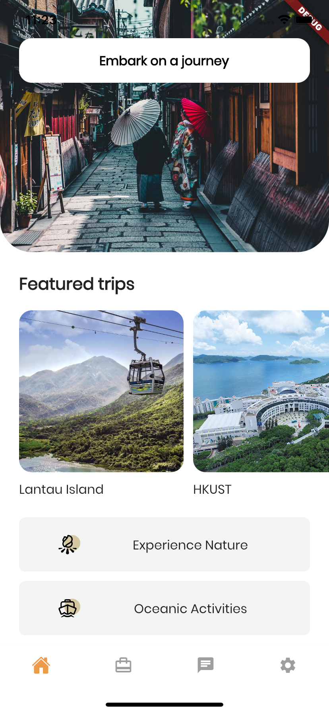
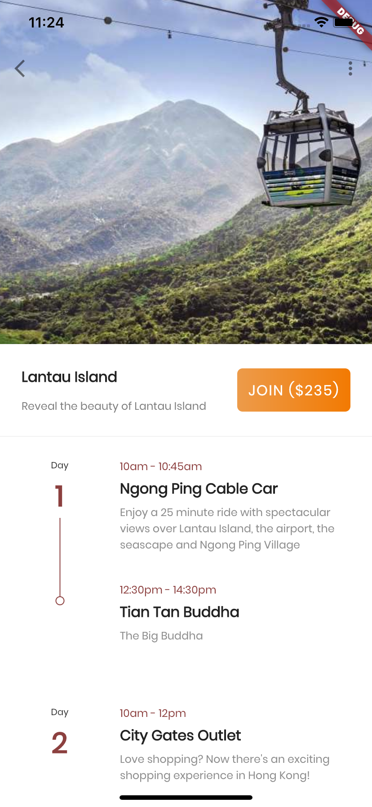
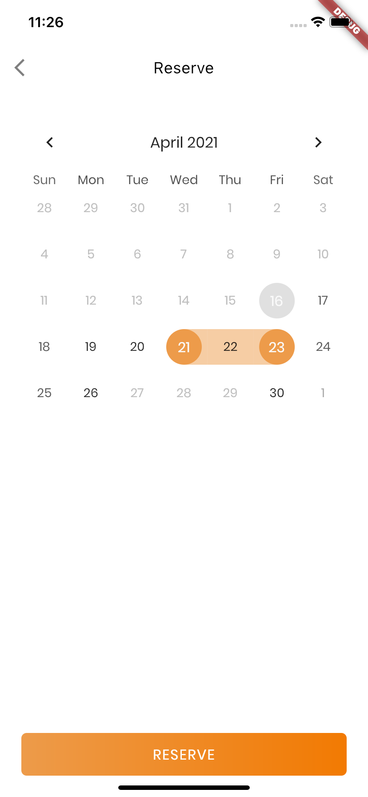
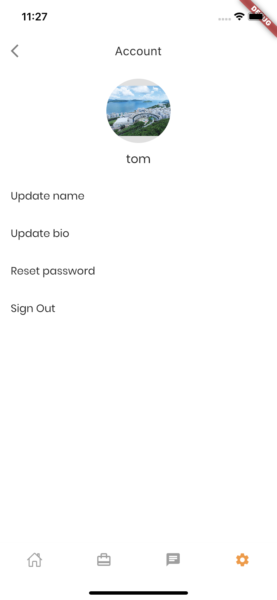
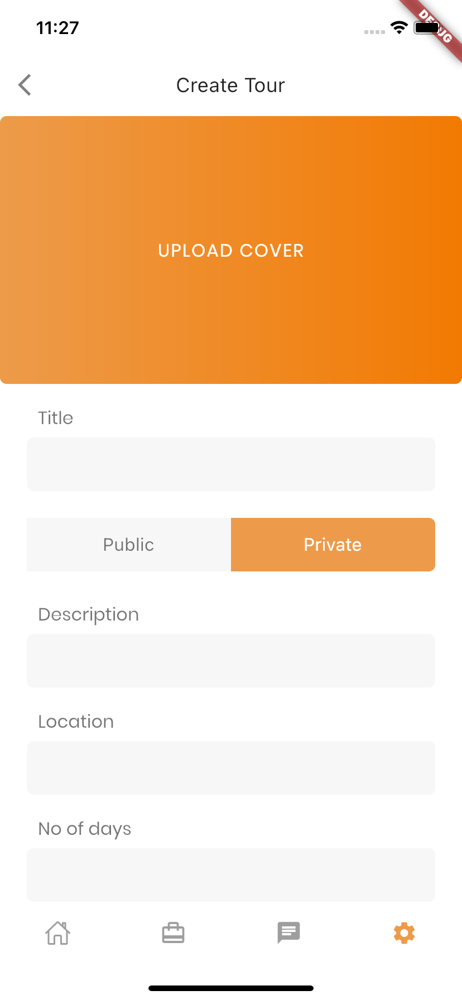
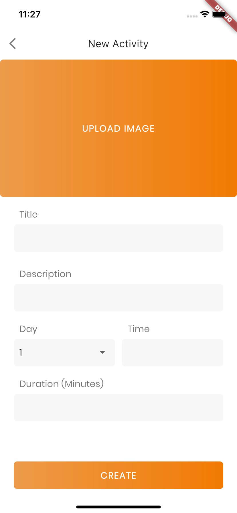
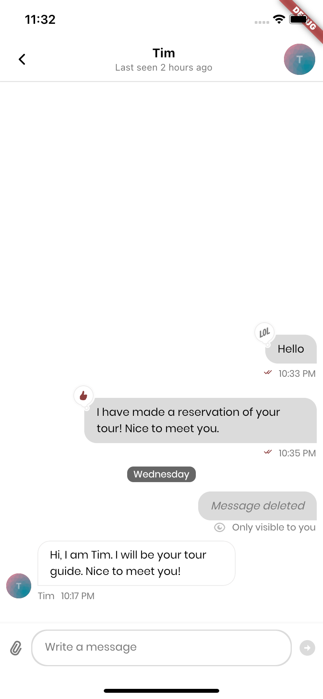

# Touroll
|   |Frontend   |Backend   |
| :------------: | :------------: | :------------: |
|Framework   |Flutter   |NestJS   |
|Language   |Dart   |Node.js with TypeScript   |
|Repository   |[Click here to frontend repository](https://github.com/lawhowang/touroll/ "Click here to backend repository")   |[Click here to backend repository](https://github.com/lawhowang/touroll-backend/ "Click here to backend repository")   |

## SDK/Library/API mainly used
- Firebase Auth (For authentication)
- StreamChat Flutter SDK (For chat and messaging)
- Google Map API (For displaying map, querying places)
- Google Geocoding API (For converting coordinates to place)

## Running the app
```sh
flutter run
```

## Some screenshots!






